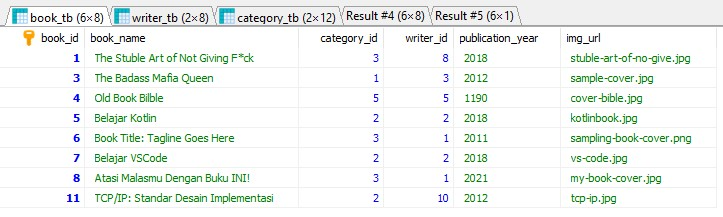
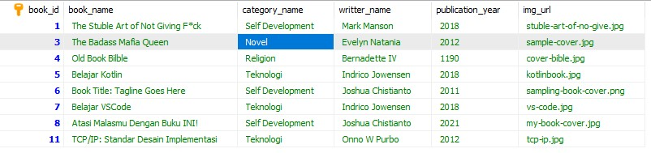
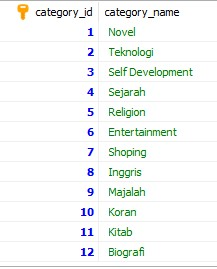
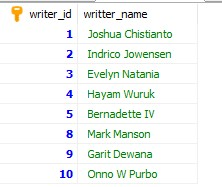
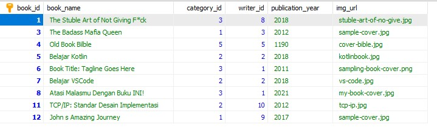

# Query dengan hasil dari books_db.sql

## Get books from book_tb

```select inner join books
SELECT * FROM book_tb;
```



## Get books from book_tb join with category_tb and writer_tb

```select inner join books
SELECT book_tb.book_id, book_tb.book_name, category_tb.category_id ,category_tb.category_name, writer_tb.writer_id, writer_tb.writter_name, book_tb.publication_year, book_tb.img_url FROM book_tb INNER JOIN category_tb on book_tb.category_id = category_tb.category_id INNER JOIN writer_tb on book_tb.writer_id = writer_tb.writer_id;
```



## Get a specific book from book_tb join with category_tb and writer_tb

```select inner join books
SELECT book_tb.book_id, book_tb.book_name, category_tb.category_id ,category_tb.category_name, writer_tb.writer_id, writer_tb.writter_name, book_tb.publication_year, book_tb.img_url FROM book_tb INNER JOIN category_tb on book_tb.category_id = category_tb.category_id INNER JOIN writer_tb on book_tb.writer_id = writer_tb.writer_id where book_tb.book_id = 1;
```


## Get Category

```select category
SELECT * FROM category;
```



## Get Writer

```select writer
SELECT * FROM writer_tb;
```



## Post a book

```insert data
INSERT INTO book_tb (book_name, category_id, writer_id, publication_year, img_url)
VALUES ('John s Amazing Journey', 1, 9, '2017', 'sample-cover.jpg')
```

hasil:


