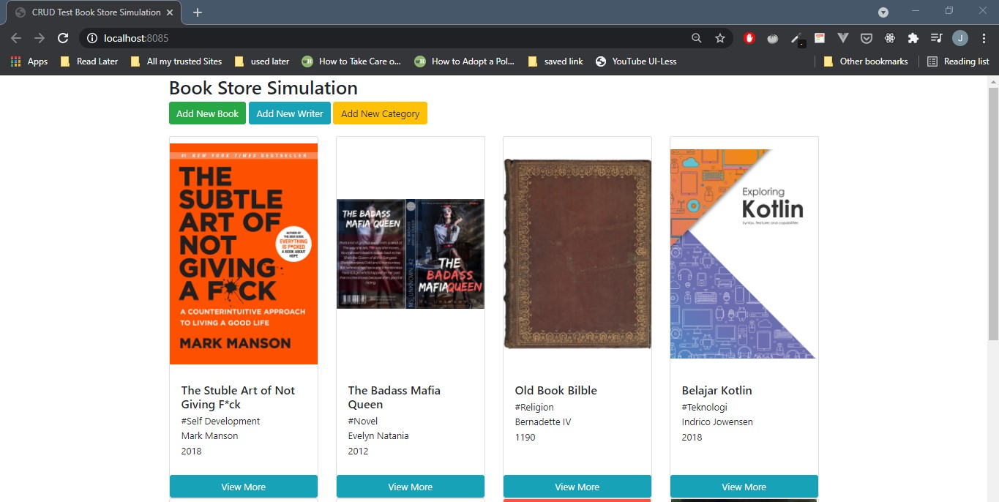
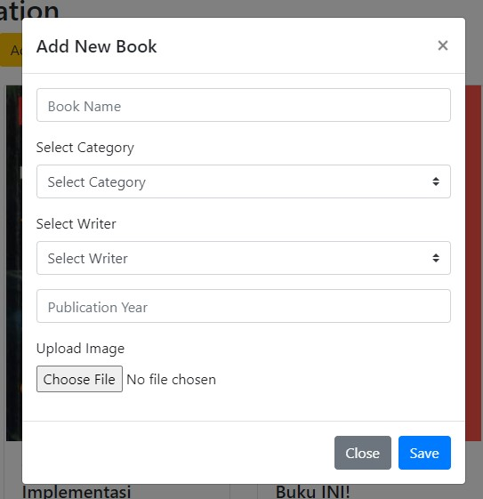
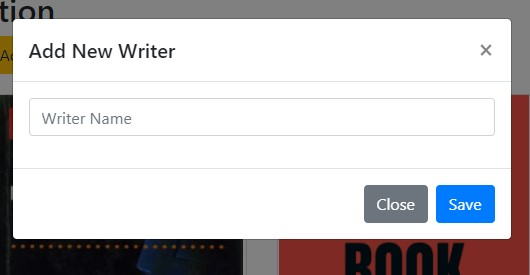
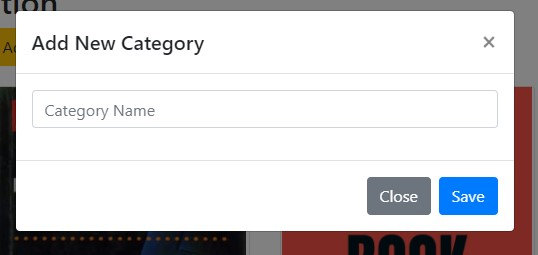
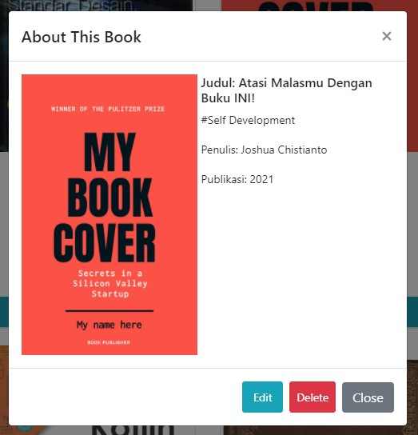
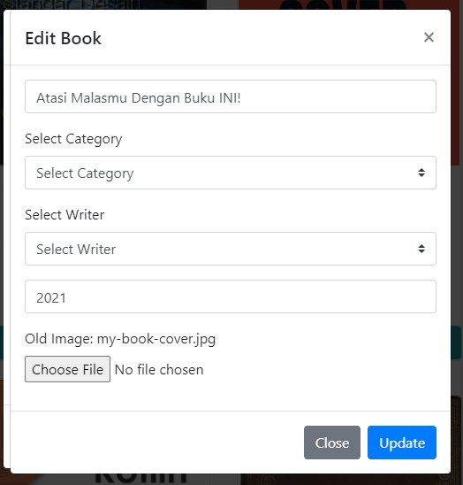

# Tampilan hasil app sederhana CRUD beserta penjelasannya

## Penjelasan tentang program ini

Nama folder: nomor-4a (untuk SQL file dengan penjelasan disetiap querynya), nomor-4b (untuk file-file app CRUD sederhana beserta penjelasannya)
Bahasa pemrograman: Javascript (Node.JS)
Framework yang digunakan: Bootstrap (UI), Express.JS(Back-End)
Middleware:

- Body-Parser(Parsing antara HTTP dengan elemen body dari view engine)
- express-fileupload(Untuk upload file image)
- mysql(Lebih tepatnya module, untuk bisa terkoneksi antara javascript Node.JS dengan database MySQL)

View Engine: hbs(Handlebars, sebuah view engine untuk menampilkan hasil response dari dan menampung request kepada express js)

## Penjelasan isi dalam folder nomor-4b

- node_module (Berisi module dari node untuk bisa menjalankan program sederhana ini)
- public (Berisi beberapa komponen penunjang view engine)
  - img (Tempat dimana gambar yang sudah diupload disimpan)
  - js (Tempat script-script untuk penunjang UI dan back-end)
  - style (Tempat untuk mengatur style dari view engine)
- views (Sebagai tempat dimana program akan menampilkan halaman utama view engine)
- index.js (File yang mengatur semua aktivitas back-end program)

## Penjelasan isi berupa gambar

### Halaman Utama

### Tambah Buku

### Tambah Penulis

### Tambah Kategori

### Lihat Deskripsi Buku

### Edit Isi Buku

### Delete Buku

